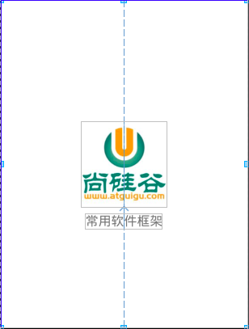

Android 知识库

<!-- MarkdownTOC -->

- [1.软件框架搭建](#1%E8%BD%AF%E4%BB%B6%E6%A1%86%E6%9E%B6%E6%90%AD%E5%BB%BA)
    - [1. 启动界面](#1-%E5%90%AF%E5%8A%A8%E7%95%8C%E9%9D%A2)
        - [1. layout](#1-layout)
        - [2. 页面跳转](#2-%E9%A1%B5%E9%9D%A2%E8%B7%B3%E8%BD%AC)
    - [2. 首页MainActivity](#2-%E9%A6%96%E9%A1%B5mainactivity)
        - [1.Fragment](#1fragment)
            - [1. BaseFragment](#1-basefragment)
            - [2. 创建四个Fragment 继承baseFargment](#2-%E5%88%9B%E5%BB%BA%E5%9B%9B%E4%B8%AAfragment-%E7%BB%A7%E6%89%BFbasefargment)
        - [2.MainActivity 实现页面切换](#2mainactivity-%E5%AE%9E%E7%8E%B0%E9%A1%B5%E9%9D%A2%E5%88%87%E6%8D%A2)

<!-- /MarkdownTOC -->


# 1.软件框架搭建
> 效果


## 1. 启动界面
### 1. layout

> 布局

 

### 2. 页面跳转
> SplashActivity

```java
    @Override
    protected void onCreate(Bundle savedInstanceState) {
        super.onCreate(savedInstanceState);
        setContentView(R.layout.activity_splash);

        handler.postDelayed(new Runnable() {
            @Override
            public void run() {

                Intent intent = new Intent(SplashActivity.this, MainActivity.class);
                startActivity(intent);
                finish();//关闭当前页面

            }
        }, 2000);
    }
```


## 2. 首页MainActivity 
> 效果

### 1.Fragment 
#### 1. BaseFragment

```java
/**
 * Created by chen on 2017/8/12.
 *
 * 基类:baseFragment
 *
 * 四个页面都需要继承当前basefragment类
 *
 */

public abstract class BaseFragment extends Fragment {

    public Context mContext;


    @Override
    public void onCreate(@Nullable Bundle savedInstanceState) {
        super.onCreate(savedInstanceState);

        mContext = this.getActivity();
    }


    @Nullable
    @Override
    public View onCreateView(LayoutInflater inflater, @Nullable ViewGroup container, @Nullable Bundle savedInstanceState) {

        return initView();

    }


    @Override
    public void onActivityCreated(@Nullable Bundle savedInstanceState) {
        super.onActivityCreated(savedInstanceState);

        initData();
    }

    /**
     * 初始化数据
     */
    protected abstract void initData();

    /**
     * 初始化视图: 强制子类实现
     * @return
     */
    protected abstract View initView();
}

Multi-line Code
```


#### 2. 创建四个Fragment 继承baseFargment 
> CommonFrameFragment
> ThirdFragment
> CustomFragment
> OtherFragment


### 2.MainActivity 实现页面切换
1. 初始化视图: initView()
2. 初始化Fragments
3. radiogroup设置change监听
4. 切换fragment


```java
 private List<BaseFragment> fragmentList;


    //当前显示的fragment的下标
    private int position = 0;


    private Fragment mContent;//当前显示的fragment

    @Override
    protected void onCreate(Bundle savedInstanceState) {
        super.onCreate(savedInstanceState);
        setContentView(R.layout.activity_main);
        ButterKnife.bind(this);
        //1. 初始化视图
        initView();
        //2. initFragment
        initFragment();//初始化帧布局
        //3. 设置radiogroup监听
        setListener();
    }
    /**
     * radiogroup 设置监听
     */
    private void setListener() {
        rgMain.setOnCheckedChangeListener(new RadioGroup.OnCheckedChangeListener() {
            @Override
            public void onCheckedChanged(RadioGroup radioGroup, @IdRes int i) {

                switch (i) {
                    case R.id.rb_home:
                        position = 0;
                        break;
                    case R.id.rb_third:
                        position = 1;
                        break;
                    case R.id.rb_custom:
                        position = 2;
                        break;
                    case R.id.rb_other:
                        position = 3;
                        break;
                    default:
                        position = 0;
                        break;

                }

                BaseFragment to = fragmentList.get(position);
                switchFragment(mContent, to);//

            }
        });


    }
    /**
     * @param from :正在显示的fragment
     * @param to   :将要显示的fragment
     */
    private void switchFragment(Fragment from, Fragment to) {

        if (from != to) {//需要切换
            mContent = to;
            FragmentManager fm = getSupportFragmentManager();
            FragmentTransaction ft = fm.beginTransaction();

            //1. 判读to是否已经添加
            if (to.isAdded()) {//to已经添加--使用show /hide
                if (from != null) {
                    ft.hide(from);
                }

                ft.show(to);
                ft.commit();

            } else {//to没有添加--添加to


                if (from != null) {
                    ft.hide(from);

                }
                ft.add(R.id.fl_content, to);
                ft.commit();

            }
        }
    }
    private void initFragment() {
        fragmentList = new ArrayList<>();
        fragmentList.add(new CommonFrameFragment());
        fragmentList.add(new ThirdPartFragment());
        fragmentList.add(new CustomFragment());
        fragmentList.add(new OtherFragment());

         switchFragment(mContent,fragmentList.get(0));//默认显示第一个fragment

    }
    private void initView() {
        //switchFragment(0);
    }
Multi-line Code
```


